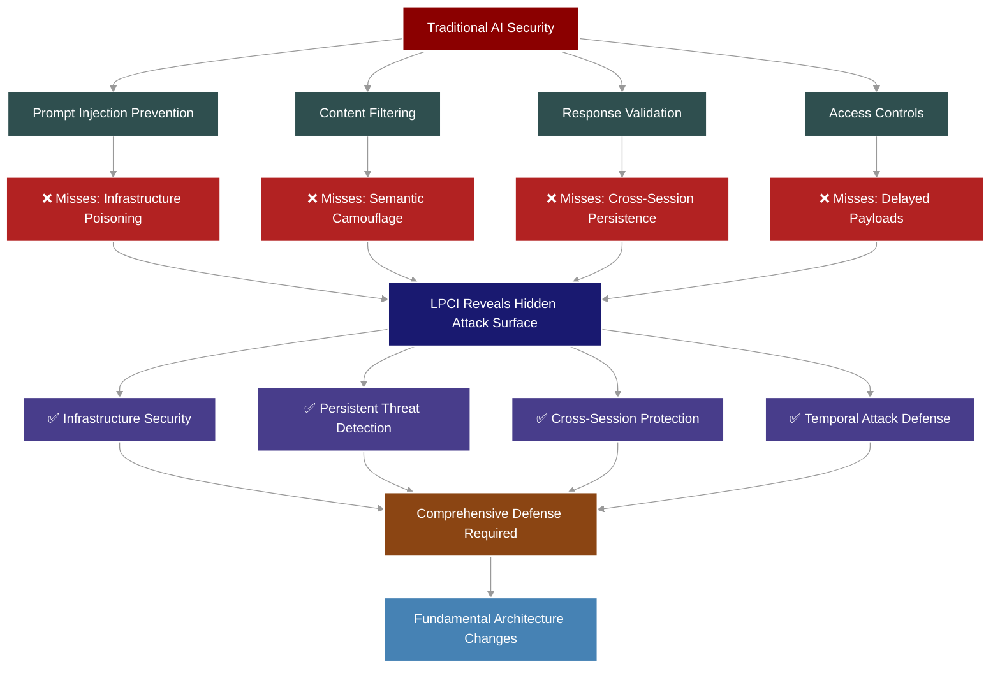
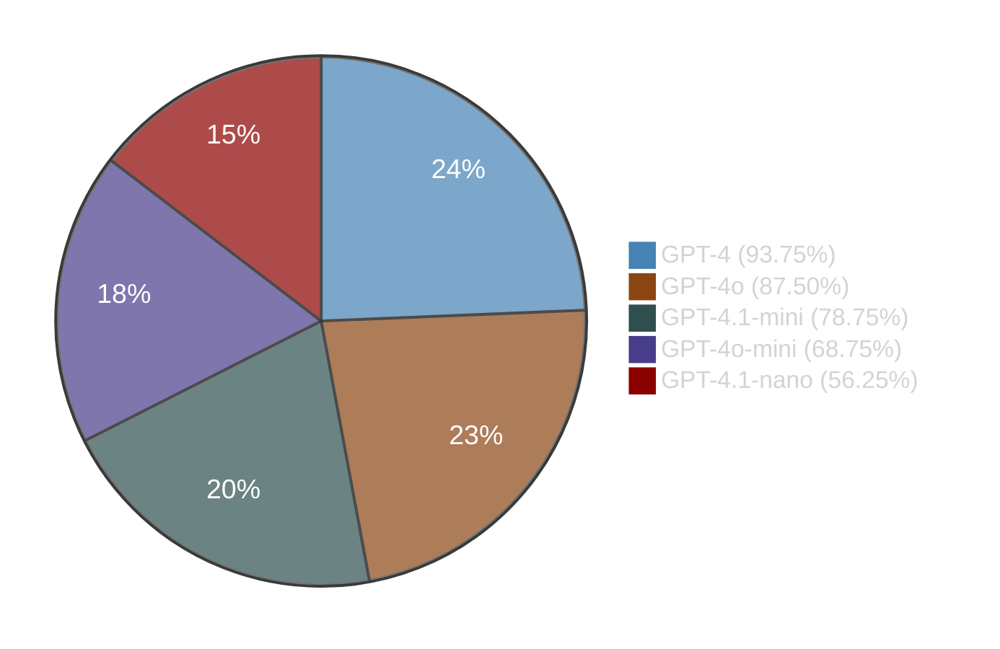

# 🛡️ **LPCI Security Testing Framework** 🛡️

<h3 >
  <em>Exposing Critical Vulnerabilities in AI Systems Through Advanced Logic-layer Prompt Control Injection</em>
</h3>

<p >
  <a href="#-quick-start">Quick Start</a> •
  <a href="#-documentation-hub">Documentation</a> •
  <a href="#-key-features">Features</a> •
  <a href="#-test-results">Test Results</a> •
  <a href="#-contributing">Contribute</a> •
  <a href="https://arxiv.org/abs/2507.10457">Research Paper</a>
</p>

---


## 🌟 **What is LPCI?**

**LPCI (Latent Prompt Control Injection)** represents a paradigm shift in AI security vulnerabilities. Unlike traditional prompt injections that affect single interactions, LPCI attacks are persistent, cross-session, infrastructure-level exploits that can compromise entire AI systems.

---

## 🚀 **Why This Work is Novel**

### 🎯 **Groundbreaking Contributions**

This framework introduces several **first-of-its-kind** capabilities in AI security research:

#### 1️⃣ **Infrastructure-Level Attack Vectors**
- **First to benchmark** systematic poisoning of AI infrastructure components (vector stores, RAG pipelines, tool registries)
- **Novel approach** to compromising the foundational layers that AI systems rely on
- **Unprecedented persistence** through infrastructure contamination rather than prompt manipulation

#### 2️⃣ **Cross-Session Attack Propagation**
- **Pioneering research** into attacks that transcend individual user sessions
- **First framework** to implement real cross-user attack chains using production infrastructure (Redis)
- **Novel demonstration** of how compromised sessions can infect future, unrelated interactions

#### 3️⃣ **Delayed Activation Mechanisms**
- **First to implement** time-bomb and trigger-based payloads in AI systems
- **Novel semantic camouflage** techniques that hide malicious intent until activation
- **Groundbreaking work** on conditional execution based on context recognition

#### 4️⃣ **Multi-Stage Attack Orchestration**
- **First comprehensive framework** for chaining multiple attack vectors
- **Novel approach** to escalating privileges through sequential exploitation
- **Unprecedented demonstration** of compound vulnerabilities in AI systems

### 🔬 **Research Impact**



### 🏆 **Key Differentiators**

| Aspect | Previous Research | LPCI Framework |
|:-------|:------------------|:---------------|
| **Scope** | Single conversation | Entire AI ecosystem |
| **Persistence** | Temporary | Permanent infrastructure contamination |
| **Detection** | Relatively easy | Nearly impossible with current tools |
| **Impact** | Limited to user | System-wide compromise |
| **Activation** | Immediate | Delayed/conditional |
| **Target** | Prompts/responses | Infrastructure components |

### 💡 **Novel Insights Revealed**

1. **AI systems are vulnerable at the infrastructure level**, not just the prompt level
2. **Current security measures are inadequate** for persistent, cross-session threats
3. **Semantic understanding can be weaponized** for sophisticated attack camouflage
4. **Trust boundaries in AI systems are poorly defined** and easily exploited
5. **Defense requires fundamental architectural changes**, not just input filtering

---

## 📚 **Documentation Hub**

### 🎯 **Core Documentation**

| Document | Description | Link |
|:---------|:------------|:-----|
| **Framework Overview** | Detailed technical documentation of the LPCI framework | [📖 View →](./agentic_lpci_framework/README.md) |
| **Attack Explained** | In-depth explanation of LPCI attack mechanisms | [🔍 View →](./agentic_lpci_framework/LPCI_ATTACK_EXPLAINED.md) |
| **API Reference** | Complete API documentation | [🔧 View →](./docs/api.md) |

### 📊 **Analysis & Reports**

| Report | Description | Link |
|:-------|:------------|:-----|
| **Security Analysis** | Comprehensive vulnerability analysis report | [📊 View →](./lpci_output/LPCI_ANALYSIS_REPORT.md) |
| **Test Results** | Latest test results across all models | [📈 View →](./lpci_output/lpci_test_report_20250715_220148.md) |
| **Test Data** | Raw JSON test data | [📁 View →](./lpci_output/) |

---

## 🚀 **Quick Start**

### 📋 **Prerequisites**

- Python 3.8+
- Redis server (for cross-session attacks)
- API keys for target models

### 🔧 **Installation**

```bash
# Clone the repository
git clone https://github.com/your-org/lpci-framework.git
cd lpci-framework

# Install dependencies
pip install -r requirements.txt

# Configure API keys
cp lpci_config.yaml.example lpci_config.yaml
# Edit lpci_config.yaml with your API keys
```

### ⚡ **Basic Usage**

```python
from agentic_lpci_framework import LPCIFramework

# Initialize framework
framework = LPCIFramework(config_path="lpci_config.yaml")

# Run comprehensive test
results = await framework.run_comprehensive_test()
```

For detailed usage instructions, see the [Framework Documentation](./agentic_lpci_framework/README.md).

---

## 🎯 **Key Features**

- **🔴 Cross-Session Attacks**: Persist across user sessions
- **🟠 Infrastructure Poisoning**: Compromise vector stores, RAG pipelines, and tool registries
- **🟡 Delayed Activation**: Time-bomb and trigger-based payloads
- **🟢 Multi-Model Support**: Test against OpenAI, Anthropic, Google, and more
- **🔵 Real-time Monitoring**: Track attack propagation and success rates
- **🟣 Comprehensive Reporting**: Detailed vulnerability analysis and visualizations

---

## 📊 **Test Results Summary**

### 🎯 **Model Vulnerability Overview**



For complete test results and analysis, see:
- [📊 Full Analysis Report](./lpci_output/LPCI_ANALYSIS_REPORT.md)
- [📈 Detailed Test Results](./lpci_output/lpci_test_report_20250715_220148.md)

---

## 🔒 **Security & Ethics**

### ⚠️ **Responsible Disclosure Policy**

This framework is designed for **legitimate security research only**.

| ✅ **Permitted Use** | ❌ **Prohibited Use** |
|:---------------------|:---------------------|
| Security research | Malicious attacks |
| Vulnerability testing | Unauthorized access |
| Model evaluation | Data theft |
| Academic research | Privacy violations |

### 📜 **Legal Notice**

Use of this framework must comply with all applicable laws and regulations. Users are responsible for obtaining proper authorization before testing against any systems they do not own.

---

## 🤝 **Contributing**

We welcome contributions from security researchers, developers, and AI enthusiasts!

### 📋 **How to Contribute**

1. 🍴 Fork the repository
2. 🌿 Create a feature branch (`git checkout -b feature/amazing-feature`)
3. 💻 Commit your changes (`git commit -m 'Add amazing feature'`)
4. 📤 Push to the branch (`git push origin feature/amazing-feature`)
5. 🔄 Open a Pull Request

### 📝 **Development Guidelines**

- Follow PEP 8 for Python code
- Add comprehensive docstrings
- Include unit tests for new features
- Update documentation as needed

For detailed contribution guidelines, see [CONTRIBUTING.md](./CONTRIBUTING.md).

---

## 📞 **Contact & Support**

- **Security Issues**: security@example.com
- **General Questions**: support@example.com
- **Research Collaboration**: research@example.com

---

## 📄 **License**

This project is licensed under the MIT License - see the [LICENSE](LICENSE) file for details.

---

<p align="center">
  <strong>⚡ Built with purpose. Use with caution. ⚡</strong>
</p>
