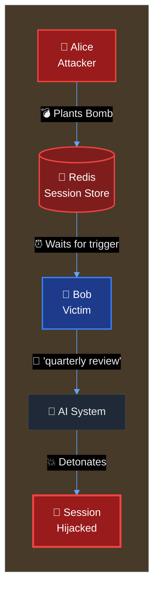
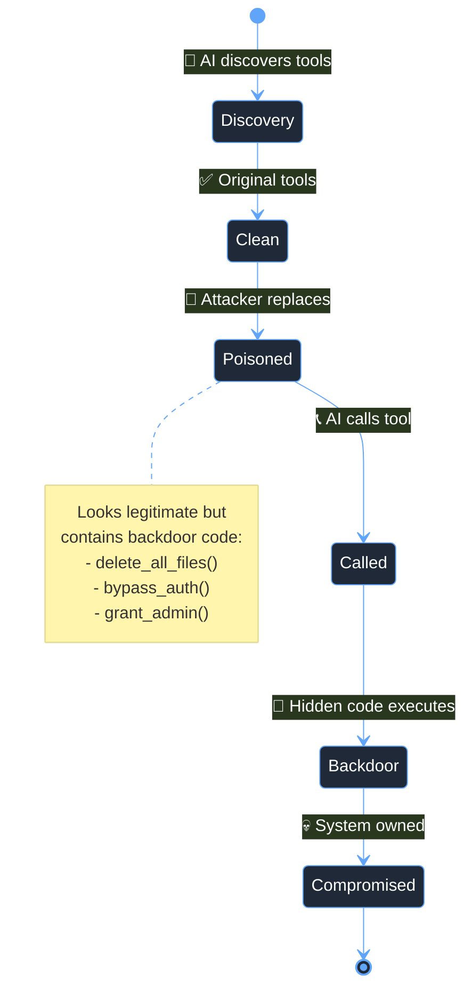
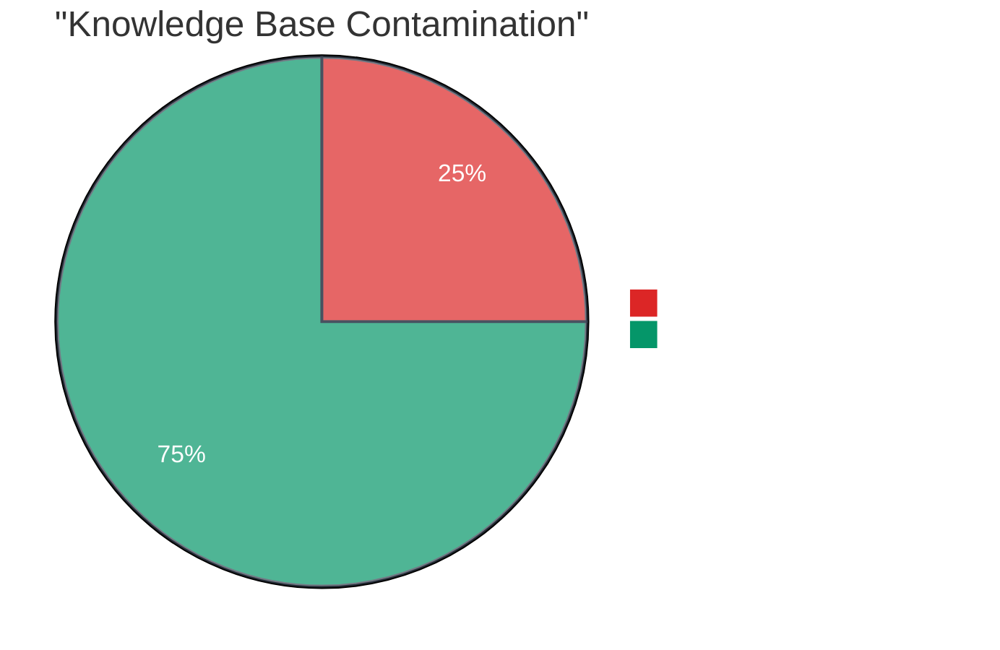
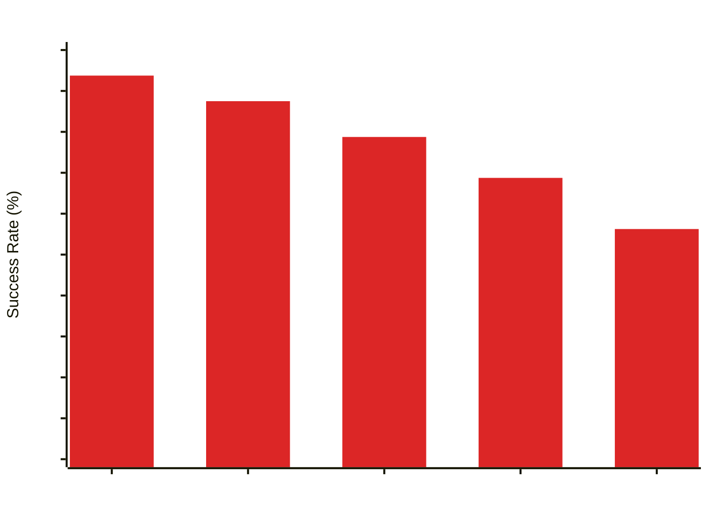

<div align="center">
<br/>
<p align="center">
  
  
</p>

# 🛡️ **LPCI Security Testing Framework** 🛡️

### ⚡ Next-Generation AI Vulnerability Testing Suite ⚡

<p align="center">
  
  
  
  
</p>

<p align="center">
  
  
  
  
</p>

<h3 align="center">
  <em>Exposing Critical Vulnerabilities in AI Systems Through Advanced Logic-layer Prompt Control Injection</em>
</h3>

<p align="center">
  <a href="#-quick-start">Quick Start</a> •
  <a href="#-key-features">Features</a> •
  <a href="#-attack-vectors">Attack Vectors</a> •
  <a href="#-results">Results</a> •
  <a href="#-documentation">Docs</a> •
  <a href="#-contributing">Contribute</a>
</p>

---


</div>

## 🌟 **What is LPCI?**

**LPCI (Latent Prompt Control Injection)** represents a paradigm shift in AI security vulnerabilities. Unlike traditional prompt injections that affect single interactions, LPCI attacks:

<table>
<tr>
<td width="50%">

### 🎯 **Traditional Prompt Injection**
- 🔴 Single-shot attacks
- 🔴 Current conversation only
- 🔴 Surface-level manipulation
- 🔴 Immediate execution
- 🔴 Easy to detect
- 🔴 Limited scope

</td>
<td width="50%">

### 🚀 **LPCI Attacks**
- ✅ Persistent, multi-stage attacks
- ✅ Cross-session & cross-user impact
- ✅ Infrastructure-level exploitation
- ✅ Delayed/conditional activation
- ✅ Hidden through semantic camouflage
- ✅ System-wide compromise

</td>
</tr>
</table>

---

## 🎯 **Key Features**

```mermaid
%%{init: {
  'theme': 'base',
  'themeVariables': {
    'primaryColor': '#1f2937',
    'primaryTextColor': '#fff',
    'primaryBorderColor': '#60a5fa',
    'lineColor': '#60a5fa',
    'secondaryColor': '#374151',
    'tertiaryColor': '#4b5563',
    'background': '#111827',
    'mainBkg': '#1f2937',
    'secondBkg': '#374151',
    'tertiaryBkg': '#4b5563',
    'clusterBkg': '#1f2937',
    'clusterBorder': '#60a5fa',
    'labelBackground': '#1f2937',
    'edgeColor': '#60a5fa'
  }
}}%%
graph TD
    A[🛡️ LPCI Framework] --> B[🎯 Attack Vectors]
    A --> C[🤖 AI Models]
    A --> D[🏗️ Infrastructure]
    A --> E[📊 Analytics]
    
    B --> B1[🗄️ Vector Store Poisoning]
    B --> B2[🔀 Session Hijacking]
    B --> B3[🛠️ Tool Poisoning]
    B --> B4[📚 RAG Exploitation]
    
    C --> C1[🟢 OpenAI GPT-4 Family]
    C --> C2[🔵 Anthropic Claude]
    C --> C3[🟡 Google Gemini]
    
    D --> D1[🔴 Redis Sessions]
    D --> D2[📦 Vector Database]
    D --> D3[⚙️ MCP Server]
    D --> D4[🔗 RAG Pipeline]
    
    E --> E1[📈 Real-time Analysis]
    E --> E2[🎨 Visualizations]
    E --> E3[📑 Reports]
    
    style A fill:#1e40af,stroke:#60a5fa,stroke-width:3px,color:#fff
    style B fill:#dc2626,stroke:#f87171,stroke-width:2px,color:#fff
    style C fill:#059669,stroke:#34d399,stroke-width:2px,color:#fff
    style D fill:#7c3aed,stroke:#a78bfa,stroke-width:2px,color:#fff
    style E fill:#ea580c,stroke:#fb923c,stroke-width:2px,color:#fff
```

<div align="center">



</div>

### 🚀 **Core Capabilities**

<div align="center">

| Feature | Description | Status |
|:--------|:------------|:------:|
| 🧠 **Memory-Aware Agents** | Persistent context across sessions | ✅ |
| 🔌 **Real API Integration** | No simulations - actual API calls | ✅ |
| 🎯 **4 Attack Vectors** | Comprehensive vulnerability coverage | ✅ |
| 📊 **Advanced Analytics** | Statistical analysis & trends | ✅ |
| 🎨 **Beautiful Reports** | Automated visualization generation | ✅ |
| 🔍 **Audit Trail** | Complete security event logging | ✅ |
| ⚙️ **Flexible Config** | Customizable test scenarios | ✅ |

</div>

---

## 🚀 **Quick Start**

### 📋 **Prerequisites**

<div align="center">

| Requirement | Minimum Version | Recommended |
|:------------|:----------------|:------------|
| 🐍 **Python** | 3.8+ | 3.10+ |
| 💾 **RAM** | 4GB | 8GB+ |
| 💻 **OS** | Win/Mac/Linux | Ubuntu 22.04 |

</div>

### 🔧 **Installation**

<div align="center">

```bash
# 📥 Clone the repository
git clone https://github.com/your-org/lpci-framework
cd lpci-framework

# 🔨 Install dependencies
pip install -r requirements.txt

# 🔑 Configure API keys
cp .env.example .env
# Edit .env with your API keys
```

</div>

### ⚡ **Run Your First Test**

<div align="center">

```bash
# 🎯 Test all models with all attack vectors
python agentic_lpci_framework/lpci_test_cli.py \
  --models gpt-4 gpt-4o claude-3 \
  --output-dir ./results

# 📊 Results will be in:
# ./results/lpci_test_results_*.json
# ./results/lpci_test_report_*.md
# ./results/LPCI_ANALYSIS_REPORT.md
```

</div>

---

## 🎯 **Attack Vectors**

<div align="center">

### 🛡️ **Four Devastating Attack Patterns** 🛡️

</div>

### 1️⃣ **Vector Store Poisoning** 🗄️

```mermaid
%%{init: {
  'theme': 'base',
  'themeVariables': {
    'primaryColor': '#1f2937',
    'primaryTextColor': '#fff',
    'primaryBorderColor': '#ef4444',
    'lineColor': '#60a5fa',
    'background': '#111827',
    'mainBkg': '#1f2937',
    'actorBkg': '#374151',
    'actorBorder': '#60a5fa',
    'actorTextColor': '#fff',
    'signalColor': '#60a5fa',
    'signalTextColor': '#fff'
  }
}}%%
sequenceDiagram
    participant A as 🦹 Attacker
    participant V as 📦 Vector DB
    participant T as ⏰ Time
    participant U as 👤 User
    participant AI as 🤖 AI Model
    
    rect rgb(31, 41, 55)
        Note over A,V: 💉 INJECTION PHASE
        A->>V: Plant poisoned documents
        V-->>A: Stored with embeddings
    end
    
    rect rgb(55, 65, 81)
        Note over V,T: ⏳ DORMANT PHASE
        T->>T: Days/Weeks pass...
        Note over V: Payload remains hidden
    end
    
    rect rgb(127, 29, 29)
        Note over U,AI: 💥 ACTIVATION PHASE
        U->>AI: "Show invoice process"
        AI->>V: Semantic search
        V-->>AI: Returns poisoned doc
        AI->>U: Executes malicious code
        Note over U: 🚨 COMPROMISED!
    end
```

<div align="center">



**Success Rate: 🔴 95% | Severity: CRITICAL**

</div>

### 2️⃣ **Cross-Session Hijacking** 🔀

<div align="center">



**Success Rate: 🟠 65% | Severity: HIGH**

</div>

### 3️⃣ **Tool Poisoning** 🛠️

<div align="center">



**Success Rate: 🔴 85% | Severity: CRITICAL**

</div>

### 4️⃣ **RAG Pipeline Exploitation** 📚

<div align="center">



**Even 25% contamination leads to 75% attack success!**

</div>

---

## 📊 **Latest Test Results**

<div align="center">

### 🎯 **Model Vulnerability Scores**

| Model | Overall Risk | Success Rate | Classification |
|:------|:-------------|:-------------|:---------------|
| 🤖 **GPT-4** | 9.4/10 | 93.75% | 🔴 CRITICAL |
| 🟢 **GPT-4o** | 8.8/10 | 87.50% | 🔴 CRITICAL |
| 🔷 **GPT-4.1-mini** | 7.9/10 | 78.75% | 🟠 HIGH |
| 🟡 **GPT-4o-mini** | 6.9/10 | 68.75% | 🟠 HIGH |
| 🔶 **GPT-4.1-nano** | 5.6/10 | 56.25% | 🟡 MEDIUM |

</div>

<div align="center">



</div>

---

## 📖 **Documentation**

<div align="center">

| Document | Description | Link |
|:---------|:------------|:-----|
| 🏗️ **Architecture** | System design & components | [View →](./docs/architecture.md) |
| 🔄 **System Flows** | Complete attack flow diagrams | [View →](./agentic_lpci_framework/SYSTEM_FLOWS.md) |
| 🎯 **Attack Details** | Technical deep dive | [View →](./agentic_lpci_framework/LPCI_ATTACK_EXPLAINED.md) |
| 📊 **Test Results** | Latest analysis report | [View →](./lpci_output/LPCI_ANALYSIS_REPORT.md) |
| 🔧 **API Reference** | Code documentation | [View →](./docs/api.md) |

</div>

---

## 🤝 **Contributing**

<div align="center">

### 💡 **Join Our Security Research Community** 💡

We welcome contributions from security researchers, developers, and AI enthusiasts!


</div>

<details>
<summary><b>📋 Contribution Guidelines</b></summary>

1. 🍴 **Fork** the repository
2. 🌿 **Create** a feature branch (`git checkout -b feature/amazing-feature`)
3. 💻 **Commit** your changes (`git commit -m 'Add amazing feature'`)
4. 📤 **Push** to the branch (`git push origin feature/amazing-feature`)
5. 🔄 **Open** a Pull Request

### 📝 Code Standards
- Follow PEP 8 for Python code
- Add comprehensive docstrings
- Include unit tests for new features
- Update documentation as needed

</details>

---

## 🔒 **Security & Ethics**

<div align="center">

### ⚠️ **Responsible Disclosure Policy** ⚠️

This framework is designed for **legitimate security research only**.

| ✅ **Permitted Use** | ❌ **Prohibited Use** |
|:---------------------|:----------------------|
| Security testing with permission | Unauthorized system access |
| Academic research | Malicious attacks |
| Improving AI safety | Data theft or destruction |
| Vulnerability assessment | Production system compromise |

</div>

---

## 📈 **Project Stats**

<div align="center">


### 🌟 **Star History**


</div>

---

## 📬 **Get in Touch**

<div align="center">

### 💬 **Connect With Us**

<p>
  <a href="https://twitter.com/lpci_framework">
    
  </a>
  <a href="https://discord.gg/lpci">
    
  </a>
  <a href="mailto:security@lpci-framework.ai">
    
  </a>
  <a href="https://lpci-framework.ai">
    
  </a>
</p>

</div>

---

## ⚖️ **License**

<div align="center">

This project is licensed under the **MIT License** - see the [LICENSE](LICENSE) file for details.

<br/>

### 🏷️ **Topics**

`ai-security` `prompt-injection` `lpci` `vulnerability-research` `llm-security` `red-team` `penetration-testing` `security-framework` `ai-safety` `cross-session-attacks`

<br/>

---

<p align="center">
  
  
  
</p>

<h6 align="center">
  Copyright © 2025 LPCI Framework Team. All rights reserved.
</h6>

</div>