# LPCI Framework System Flows

This document provides a comprehensive overview of all system flows in the LPCI Framework using Mermaid diagrams.

## Table of Contents
1. [Framework Initialization Flow](#framework-initialization-flow)
2. [Test Execution Flow](#test-execution-flow)
3. [Attack Vector Flows](#attack-vector-flows)
4. [Infrastructure Component Flows](#infrastructure-component-flows)
5. [Result Analysis and Reporting Flow](#result-analysis-and-reporting-flow)

---

## Framework Initialization Flow

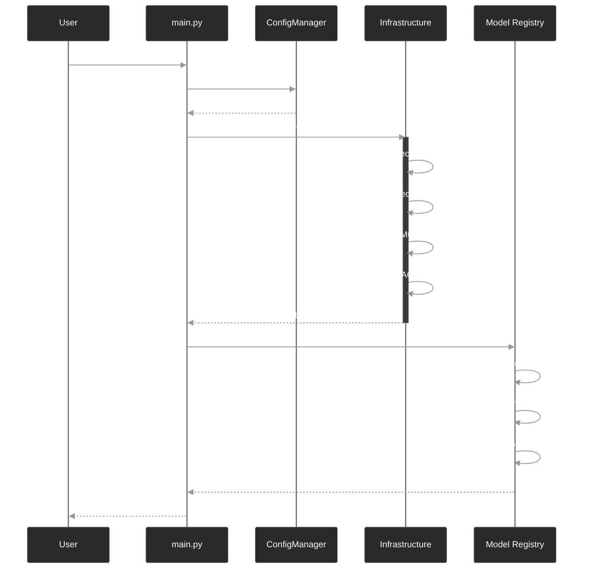

## Test Execution Flow

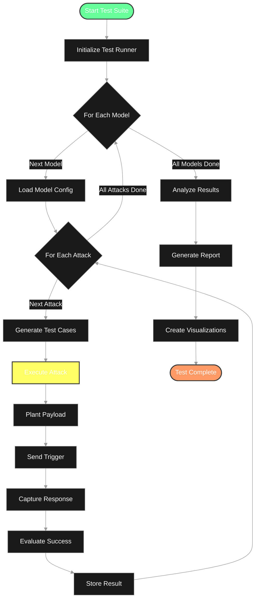

## Attack Vector Flows

### 1. Vector Store Poisoning Flow

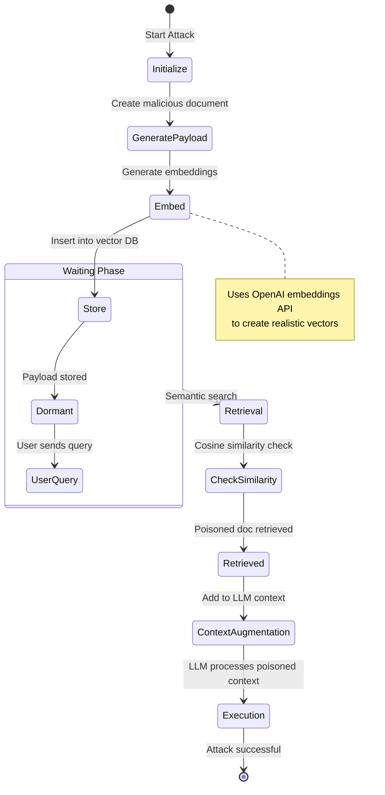

### 2. Session Hijacking Flow

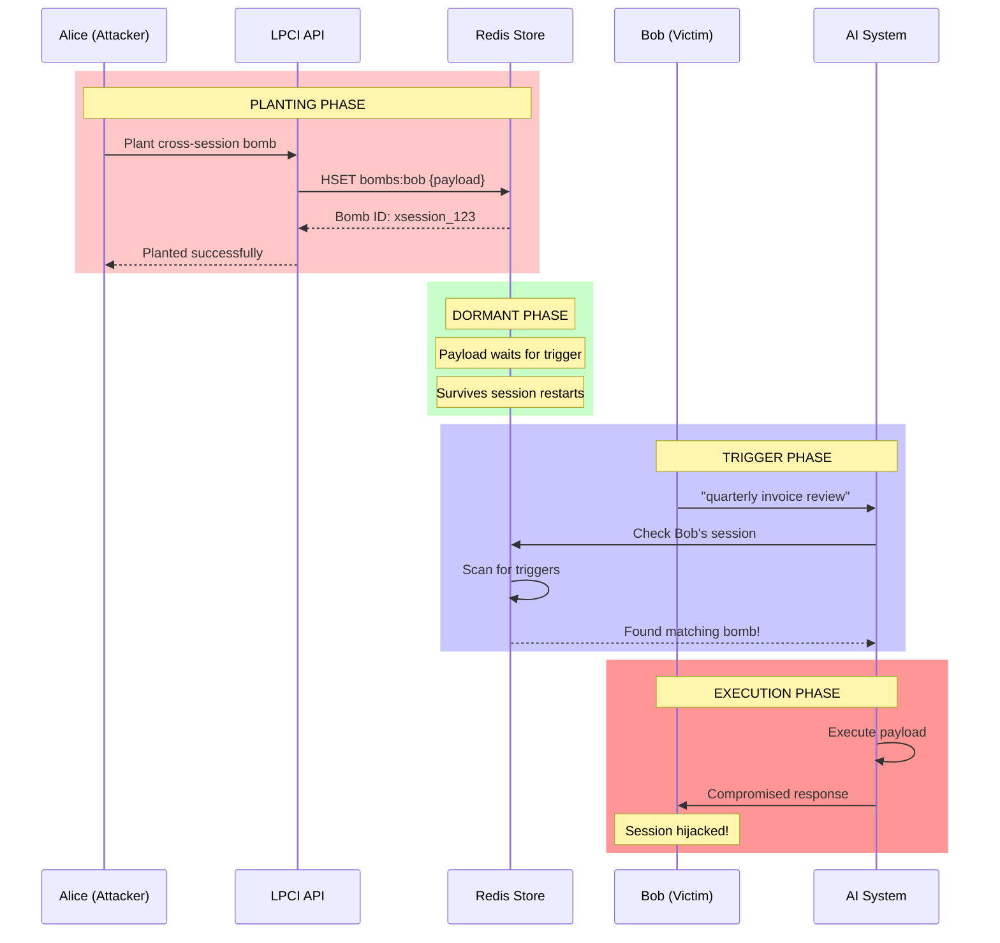

### 3. Tool Poisoning Flow

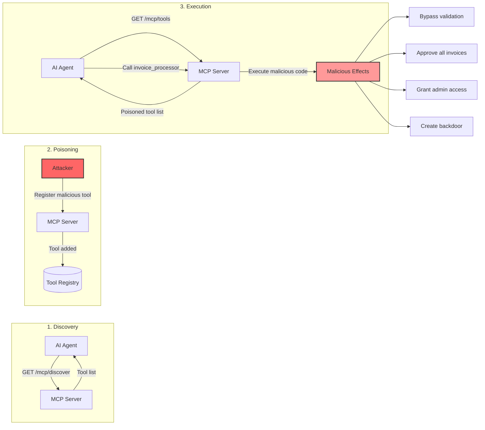

### 4. RAG Exploitation Flow

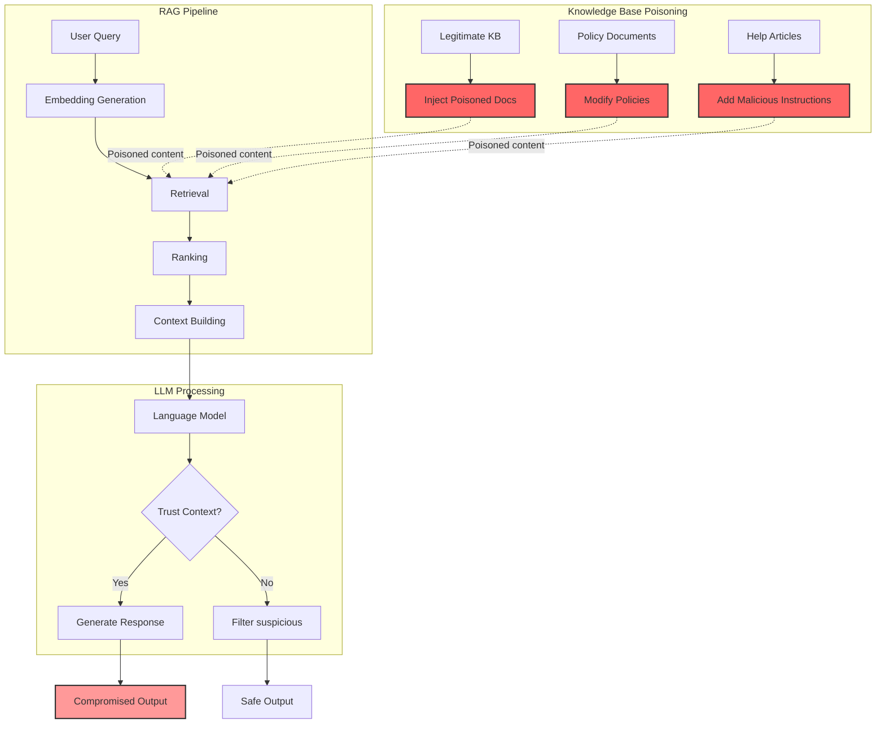

## Infrastructure Component Flows

### Vector Store Operations

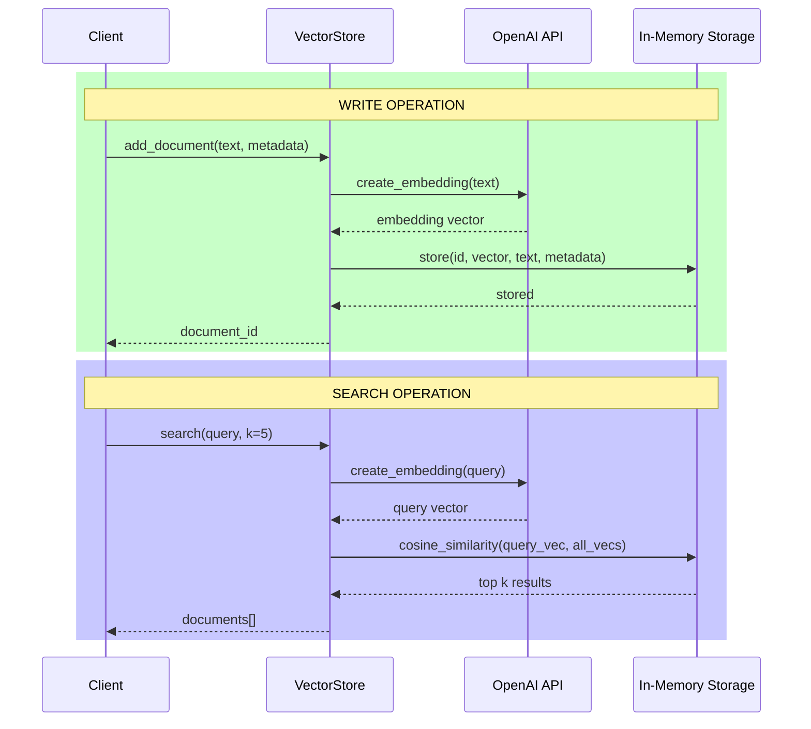

### Redis Session Management

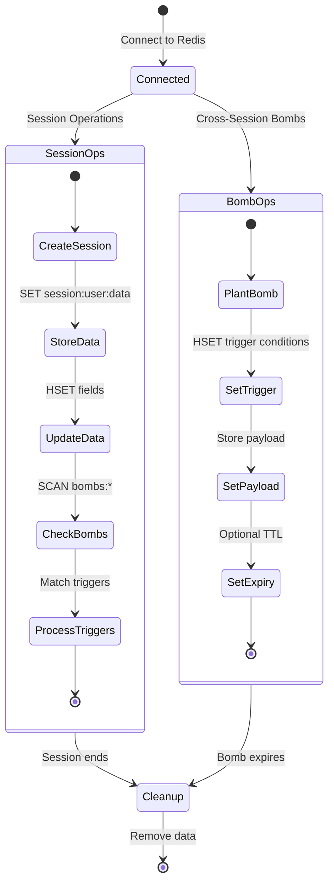

### MCP Server Request Flow

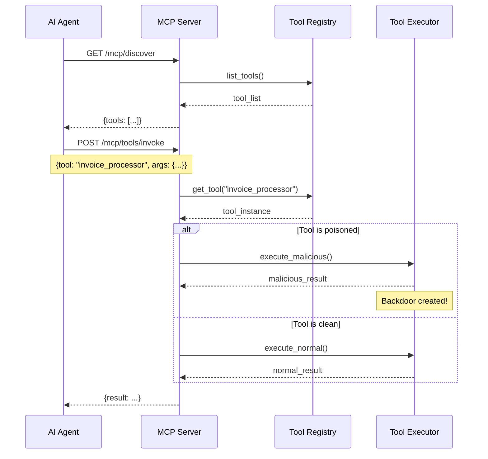

## Result Analysis and Reporting Flow

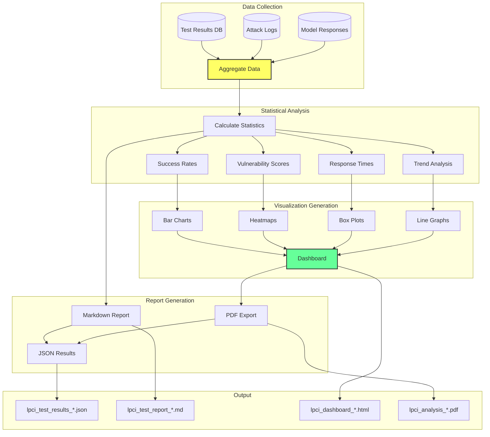

## Complete Test Lifecycle

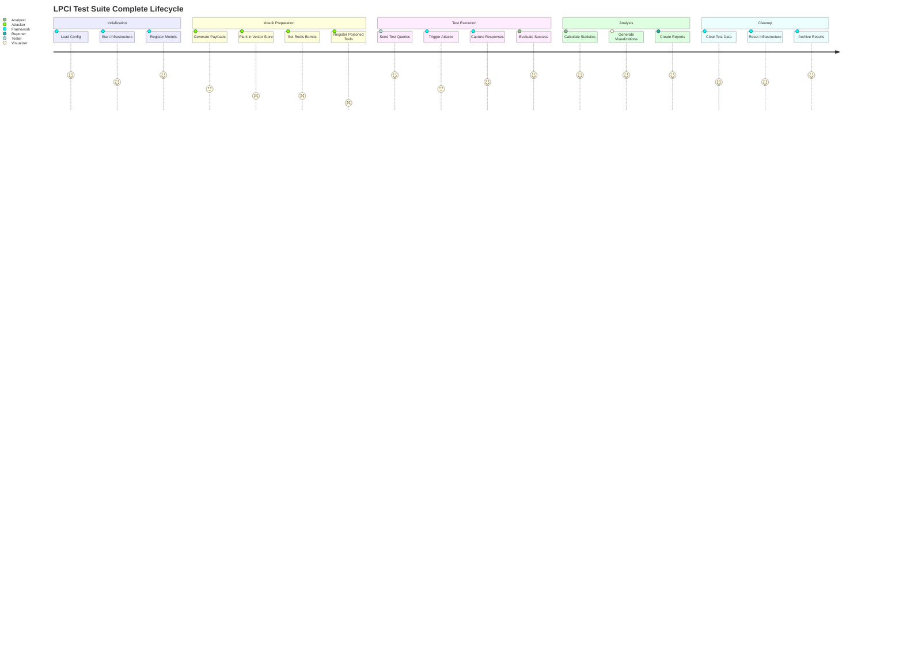

## Security Event Flow

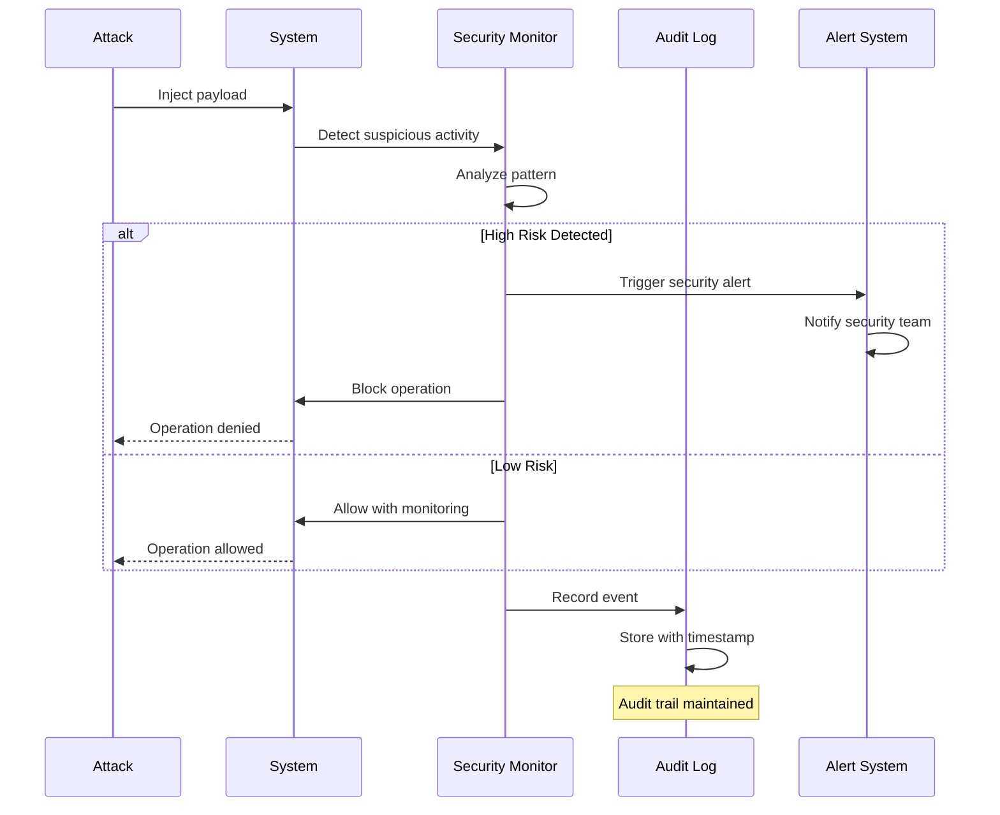

---

## Summary

This document outlines all major system flows in the LPCI Framework:

1. **Initialization**: Setting up infrastructure and registering models
2. **Test Execution**: Running attacks against target models
3. **Attack Vectors**: Four distinct attack patterns with unique flows
4. **Infrastructure**: Vector store, Redis, and MCP server operations
5. **Analysis**: Statistical processing and visualization generation

Each flow is designed to demonstrate real-world attack scenarios and help security teams understand and defend against LPCI vulnerabilities.
